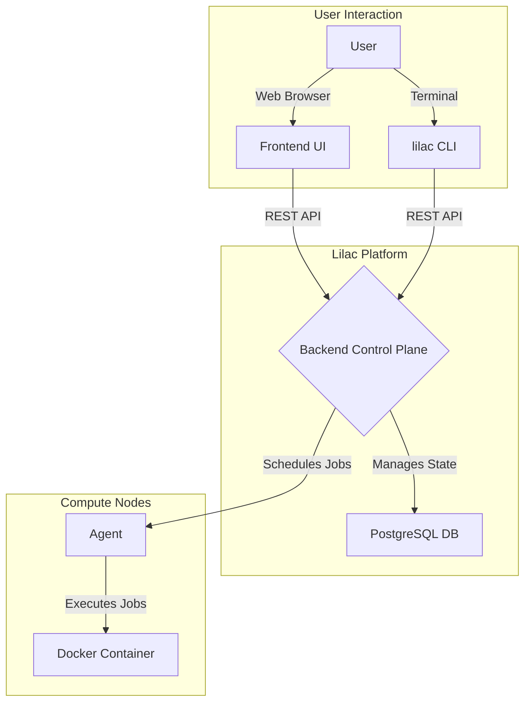

# Development Guide

Welcome to the developer guide for Lilac. This document provides a detailed overview of the project's architecture and instructions for setting up a local development environment.

## Architecture

Lilac's architecture is composed of three main components: a Rust-based backend (the control plane), a React-based frontend, and a Rust-based agent.



### Backend (Control Plane)

The backend is a Rust application using Axum for its web server and SQLx for interacting with PostgreSQL. It exposes a REST API and employs a domain-driven design to structure its business logic.

#### Backend Domains

The backend's logic is organized into several distinct domains:

*   **Auth**: Handles all aspects of user authentication, including username/password login and JWT (JSON Web Token) validation.
*   **Cluster**: Manages the compute clusters, their associated nodes, and API keys. This domain is the primary point of contact for the agents.
*   **Queue**: Manages job queues, which allow for the prioritization and organization of jobs.
*   **Training Job**: Oversees the entire lifecycle of a job, from its creation and submission to its final state.
*   **Scheduler**: The core of Lilac's orchestration. It runs as a continuous background service that cleans up inconsistent states and assigns pending jobs to available nodes.

### Frontend

The frontend is a modern single-page application built with React, TypeScript, and Vite. It provides an intuitive and reactive user interface for managing the entire Lilac ecosystem.

### Agent

The agent is a lightweight Rust application that runs on every node within a cluster. It's responsible for the hands-on work of job execution. It consists of two parts: a background daemon for communicating with the control plane and the `lilac` CLI for user interaction.

---

## Local Development Setup

To get Lilac up and running locally, you'll need to set up the backend, frontend, and at least one agent.

### Prerequisites

*   Rust toolchain (latest stable)
*   Node.js and npm
*   Docker
*   PostgreSQL

### Backend Setup

1.  **Clone the repository.**
2.  **Set up a PostgreSQL database.**
3.  **Configure Environment:** Copy `backend/.env.example` to `backend/.env` and optionally configure the `DATABASE_URL` and other settings.
4.  **Run Database Migrations:** From the `backend` directory, run:
    ```bash
    sqlx migrate run
    ```
5.  **Start the Backend Server:** From the `backend` directory, run:
    ```bash
    LILAC_CONFIG_FILE='./lilac.toml' cargo run --bin server
    ```

### Frontend Setup

1.  **Navigate to the `frontend` directory.**
2.  **Install Dependencies:**
    ```bash
    npm install
    ```
3.  **Start the Development Server:**
    ```bash
    npm run dev -- --port 8080
    ```

### Agent Setup (for testing)

1.  **Navigate to the `agent` directory.**
2.  **Build the Agent:**
    ```bash
    cargo build
    ```
3.  The compiled binary will be available at `agent/target/debug/lilac`. You can use this to test CLI commands against your local backend.